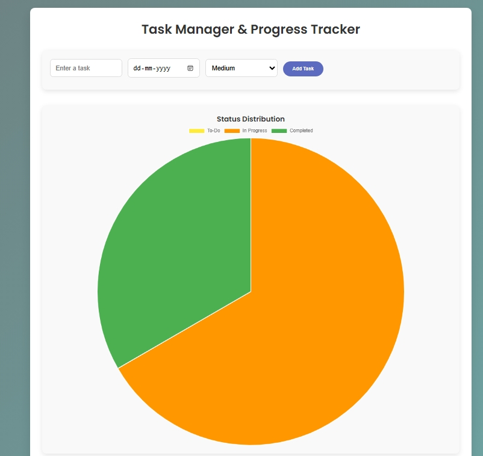

# Task Manager and Progress Tracker

A simple and dynamic task manager with a built-in progress tracker and visualizations using pie charts. The app allows you to manage tasks, track their status, and view their priority and completion stats in real-time.

## Features
- **Add Tasks**: Create tasks with titles, due dates, priorities, and statuses (To-Do, In Progress, Completed).
- **Track Task Progress**: Track progress with a progress bar showing percentage completion based on completed tasks.
- **Priority Distribution**: Visualize the distribution of tasks by priority (Low, Medium, High) in a pie chart.
- **Status Distribution**: View the breakdown of tasks by status (To-Do, In Progress, Completed) in a pie chart.
- **Real-Time Updates**: As you add or modify tasks, the charts and task list are dynamically updated.

## Screenshots



## Technologies Used
- **Frontend**: HTML, CSS, JavaScript
- **Libraries**: [Chart.js](https://www.chartjs.org/) (for pie charts)

## How to Use
1. **Clone the Repository**
   ```bash
   git clone https://github.com/yourusername/your-repository-name.git
